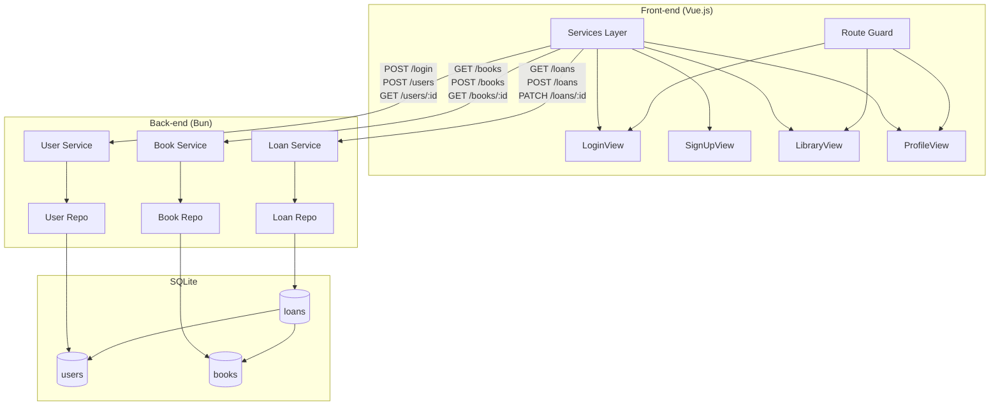

```mermaid
graph TD
    subgraph Frontend["Front-end (Vue.js)"]
        Login[LoginView]
        SignUp[SignUpView]
        Library[LibraryView]
        Profile[ProfileView]
        Guard[Route Guard]
        Services[Services Layer]

        Guard --> Login
        Guard --> Library
        Guard --> Profile
        Services --> Login
        Services --> SignUp
        Services --> Library
        Services --> Profile
    end

    subgraph Backend["Back-end (Bun)"]
        US[User Service]
        BS[Book Service]
        LS[Loan Service]
        UR[User Repo]
        BR[Book Repo]
        LR[Loan Repo]

        US --> UR
        BS --> BR
        LS --> LR
    end

    subgraph DB["SQLite"]
        Users[(users)]
        Books[(books)]
        Loans[(loans)]

        Loans --> Users
        Loans --> Books
    end

    Services -- "POST /login\nPOST /users\nGET /users/:id" --> US
    Services -- "GET /books\nPOST /books\nGET /books/:id" --> BS
    Services -- "GET /loans\nPOST /loans\nPATCH /loans/:id" --> LS

    UR --> Users
    BR --> Books
    LR --> Loans
```
